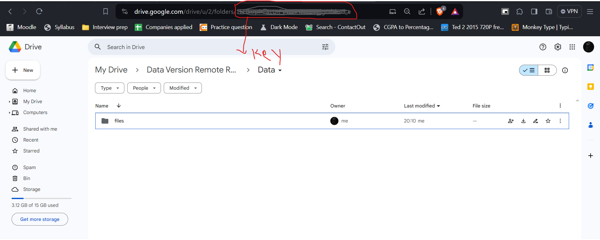

->	To install dvc in your local system

```
pip install dvc
```

-> 	To initialize git

```
git init
``` 

-> 	To initialize dvc

```
dvc init
``` 


-> you must have folder for keeping all data used for project 
   let's consider that you have folder named `data` 
   
   PS: `DVersion` is virtual environment it is completely optional


	Mode                 LastWriteTime         Length Name
	----                 -------------         ------ ----
	d-----        27-01-2024     16:50                data
	d-----        27-01-2024     16:51                DVersion


-> Assuming you have data already present in data folder you have to run the command
   
```
dvc add <path/to/data.file>
```
   
this command has added your data.file to dvc environment 

the above command will also prompt you to run following two commands
   

```
git add <path/to/data.file>.dvc <path\to\data\folder>\.gitignore
```


these two command will stage the progress into `git` 

-> Now to push data into our own seperate remote storage also known as `DVC Remote`
   
   We need to setup an remote origin for dvc same as the one we use for git

   Syntax of adding remote to DVC

```
dvc remote add --default <local name (e.g Origin)> gdrive://<Key of Folder in Gdrive where you want to store>
```


Sample would look like


-> After you successfully add setup remote run below command as it is 

```
git commit .dvc\config -m "Configured Remote"
```

-> To push the data to remote

```
dvc push
```

if you are pushing for first time it will prompt you to authentication by google in your default browser
   
   ```OR``` 

if you get error below

```
unexpected error - gdrive is supported, but requires 'dvc-gdrive' to be installed: No module named 'dvc_gdrive'
```

then you must install that dependency with command

```
pip install dvc_gdrive
```

-> wait for some time then then again run 
	
```
dvc push
``` 
```authenticate yourself``` 

wallah! you just pushed your data to remote repository congratulations

\
**-> For cloning the data files right from remote repository**
---
suppose you want to clone it into new project named
``Data Versioning Clone``
	
run 
```
git init
```

then run 
```
dvc init
```

then run 
```
dvc get https://github.com/Hardik7843/DataVersioning  <github path> -o <local path>
```


Note: If the data is in text file its `dvc` file would be `data.txt.dvc` so while addressing that file in command you have to write `<github path>` as `path\data.txt` 

the sample would look like

```
dvc get git@github.com:Hardik7843/DataVersioning.git  data/da.txt -o data/
```

`OR`

``` 
dvc get https://github.com/Hardik7843/DataVersioning  data/da.txt -o data/
```

if you get error below

```
unexpected error - gdrive is supported, but requires 'dvc-gdrive' to be installed: No module named 'dvc_gdrive'
```

then you must install that dependency with command

```
pip install dvc_gdrive
```

If you like my Way of telling instruction please star the repository for finding it for later use.